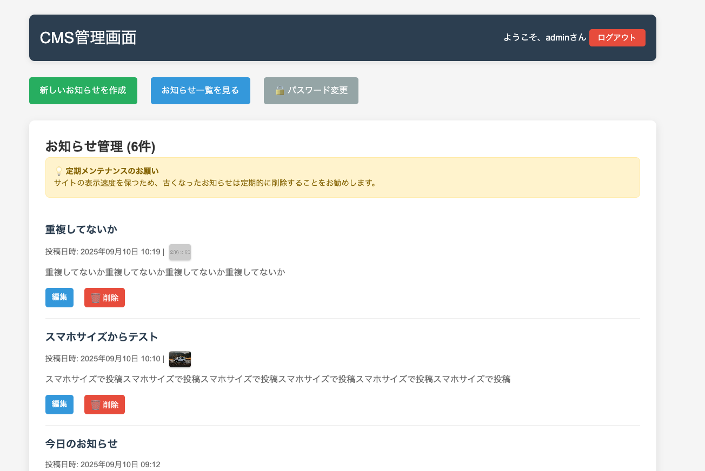
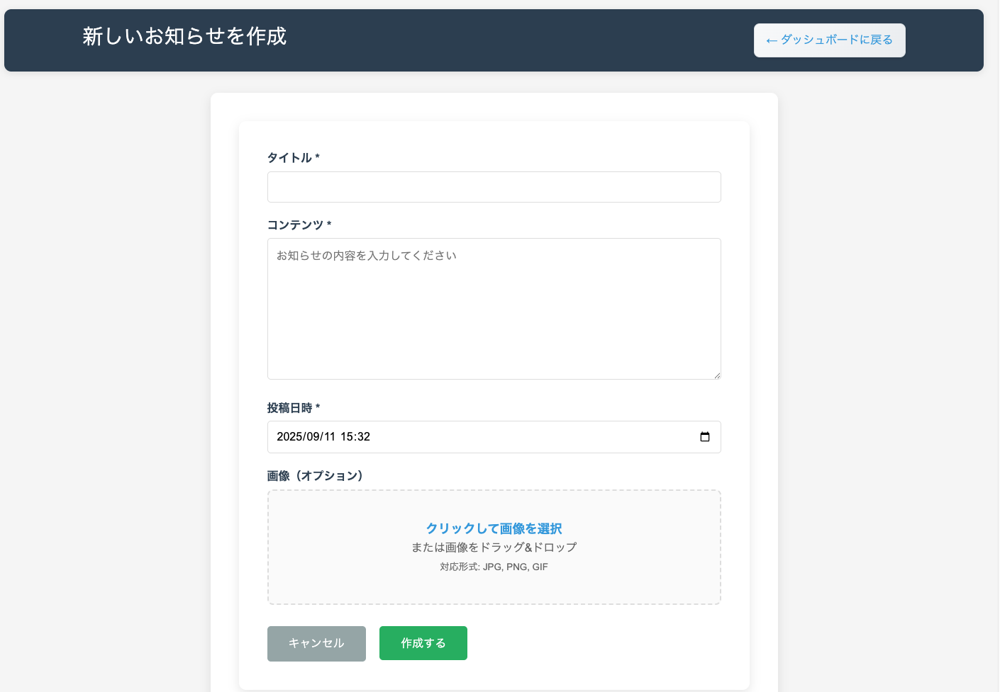
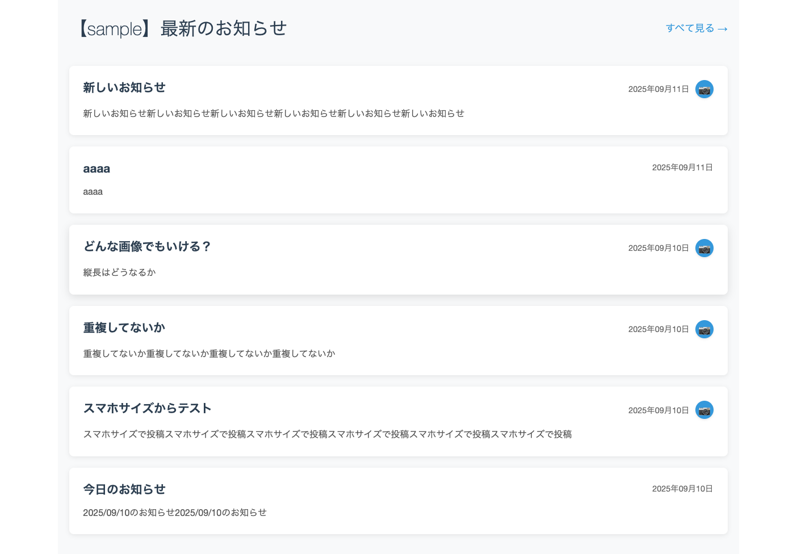

# 猫の手 CMS (Nekonote CMS)

シンプルで軽量な PHP 製コンテンツ管理システム。データベース不要で JSON ファイルベースの記事管理が可能です。

## 🚀 まずは動かしてみよう！

MAMP などのローカル環境で簡単に試せます。

1. このフォルダをダウンロード
2. `cms/data/users.json.example` を `users.json` にリネーム（またはコピー）
3. MAMPのDocument Rootに設定
4. `http://localhost:8888/` にアクセス
5. 管理画面: `http://localhost:8888/cms/admin/`（ID: `admin` / PW: `password`）

## 📋 機能

- 📝 **記事管理**: 作成、編集、削除
- 🖼️ **画像アップロード**: 自動リサイズ・最適化
- 🎨 **レスポンシブデザイン**: モバイル対応
- 🔐 **セキュアな管理画面**: 多層セキュリティ
- 📱 **モーダル表示**: 画像のポップアップ表示
- 🚀 **高速**: データベース不要

## 🎥 スクリーンショット

### 1. ログイン画面


初期状態ではユーザー名 `admin` / パスワード `password` が表示されます。
⚠️ **本番運用前に必ず変更してください！**

### 2. 投稿画面



### 3. サイト表示



## 🛡️ セキュリティ機能

### ✅ 実装済みセキュリティ

- **パスワードハッシュ化認証** - PHP password_hash()使用
- **CSRF 攻撃防止** - 全フォームでトークン検証
- **セッション管理** - タイムアウト・ID 再生成・HTTPS時は自動でセキュアCookie
- **ファイルアップロード検証** - 画像タイプ・サイズ制限
- **ログイン試行制限** - ブルートフォース攻撃対策
- **セキュリティヘッダー** - XSS・フレーム攻撃対策・HSTS（HTTPS時）
- **XSS対策** - 出力エスケープ・安全なDOM操作

## 📦 インストール

### 必要環境

- PHP 7.4 以上
- GD 拡張（画像処理用）
- 書き込み権限のある Web サーバー

### セットアップ手順

1. **ファイルアップロード**

   ```
   フォルダ全体をWebサーバーにアップロード
   ```

2. **初期ユーザーファイルの作成**

   ```bash
   cp cms/data/users.json.example cms/data/users.json
   ```

3. **権限設定**

   ```bash
   chmod 755 cms/data/
   chmod 755 cms/uploads/
   chmod 644 cms/data/*.json
   ```

4. **管理画面アクセス**
   ```
   https://yoursite.com/cms/admin/login.php
   ```

## 🌟 templateフォルダを使おう（推奨）

**一番かんたんな方法です！** `template/` フォルダをコピーしてサーバーに配置するだけで、サイト構造とCMSが揃った状態で始められます。

```
template/
├── index.php              # トップページ
├── head.php               # <head>共通部分 ※サイト情報を編集
├── header.php             # ヘッダー
├── footer.php             # フッター
├── page-title.php         # ページタイトル
├── about/                 # 下層ページ例
├── news/                  # お知らせ一覧
├── information/           # 店舗情報ページ例
├── dest/                  # CSS/JS
└── cms/                   # CMSシステム一式
```

**使い方:**
1. `template/` フォルダごとコピー
2. サーバーのドキュメントルートに配置
3. `head.php` のサイト情報を書き換え（タイトル、URL、説明文、OGP等）
4. `/cms/admin/` から管理画面にアクセス

> 📖 詳しくは `template/README.md` を参照してください。

---

## 📁 ディレクトリ構造

```
nekonote-cms/
├── .htaccess              # URL書き換え用（.php省略）
├── index.php              # トップページ
├── news.php               # お知らせ一覧ページ
├── about.php              # アバウトページ
├── head.php               # <head>共通部分
├── header.php             # ヘッダー
├── footer.php             # フッター
└── cms/                   # CMSシステム一式
    ├── admin/             # 管理画面
    │   ├── login.php      # ログイン
    │   ├── logout.php     # ログアウト
    │   ├── dashboard.php  # 管理トップ
    │   ├── create.php     # 新規作成
    │   ├── edit.php       # 編集
    │   ├── change_password.php  # パスワード変更
    │   ├── security_check.php   # セキュリティチェック
    │   └── styles.css     # 管理画面スタイル
    ├── data/              # データ保存
    │   ├── news.json      # お知らせデータ
    │   └── users.json     # 管理者アカウント
    ├── uploads/           # アップロード画像
    ├── docs/              # ドキュメント・スクリーンショット
    ├── frontend.css       # フロント用スタイル
    ├── frontend.js        # 画像ポップアップ機能
    ├── functions.php      # 共通関数
    └── security_config.php # セキュリティ設定
```

## 🔑 初期設定

### デフォルトログイン情報

- **ユーザー名**: `admin`
- **パスワード**: `password`

⚠️ **重要**: 初回ログイン後、必ず管理画面の「パスワード変更」で強力なパスワードに変更してください。

### ユーザー名の変更

ユーザー名は `cms/data/users.json` を直接編集して変更できます：

```json
[
  {
    "username": "your-username",  ← ここを変更
    "password": "$2y$10$..."
  }
]
```

> 💡 **注意**: パスワードはハッシュ化されているため、`users.json` を直接編集しても変更できません。パスワード変更は必ず管理画面から行ってください。

## 🏠 URL設定（.htaccess）

ルートに`.htaccess`を配置すると、URLから`.php`を省略できます。

```
http://yoursite.com/about/   → about.php
http://yoursite.com/news/    → news.php
```

**.htaccessの内容:**
```apache
Options +FollowSymLinks
RewriteEngine On

# 末尾スラッシュありのURLを処理
RewriteCond %{REQUEST_FILENAME} !-f
RewriteCond %{REQUEST_FILENAME} !-d
RewriteRule ^([^/]+)/?$ $1.php [L]
```

> ⚠️ .htaccessが不要な場合は、ファイル名を `.htaccess.disabled` にリネームして無効化できます。

## 📝 実装方法

### PHPコードの埋め込み方

**1. トップページに最新お知らせを表示**

```php
<?php
// index.php のファイル先頭に追加
require_once __DIR__ . '/cms/functions.php';
?>
```

```html
<!-- CSS読み込み -->
<link rel="stylesheet" href="/cms/frontend.css">
```

```php
<!-- お知らせを表示したい場所に追加 -->
<?php $latestNews = getLatestNews(3); // 最新3件取得 ?>

<?php if (!empty($latestNews)): ?>
    <?php foreach ($latestNews as $item): ?>
        <div class="news-item">
            <h3><?php echo htmlspecialchars($item['title']); ?></h3>
            <p><?php echo nl2br(htmlspecialchars($item['content'])); ?></p>
            <?php if ($item['image']): ?>
                " class="news-image">
            <?php endif; ?>
        </div>
    <?php endforeach; ?>
<?php endif; ?>

<!-- JS読み込み -->
<script src="/cms/frontend.js"></script>
```

### 必須設定

1. **パスワード変更**

   - 初期パスワード「password」を強力なものに変更（8文字以上）

2. **HTTPS での運用（推奨）**

   - 本番環境では必ず HTTPS で運用してください
   - セッションCookieは HTTPS 時に自動でセキュア設定になります

3. **ディレクトリ保護**

   - `cms/data/` と `cms/uploads/` の直接アクセスを制限
   - `.htaccess` ファイルが正しく設置されているか確認

4. **定期メンテナンス**
   - 定期的なバックアップ
   - 古い記事・画像の整理

### オプション設定

**IP アクセス制限** (高セキュリティ環境向け)

```php
// security_check.php の以下の行のコメントを外す
checkIPAccess($ALLOWED_IPS);

// security_config.php で許可IPを設定
$ALLOWED_IPS = [
    'your.ip.address.here'
];
```

## 🎨 カスタマイズ

### 画像設定

```php
// security_config.php
$MAX_FILE_SIZE = 5 * 1024 * 1024; // 5MB
$ALLOWED_IMAGE_TYPES = ['image/jpeg', 'image/png', 'image/gif'];
```

### セッション設定

```php
// security_config.php
$SESSION_TIMEOUT = 3600; // 1時間
$SESSION_REGENERATE_INTERVAL = 300; // 5分
```

## 🔧 トラブルシューティング

### よくある問題

**Q: ログインできない**
A: ブラウザのキャッシュをクリアし、正しい認証情報を確認してください。

**Q: 画像がアップロードできない**
A: PHP 設定の `upload_max_filesize` と `post_max_size` を確認してください。

**Q: 「このページは動作していません」エラー**
A: PHP エラーログを確認し、ファイル権限を確認してください。

### 🚨 緊急復旧方法（ログイン不能時）

**ディレクトリごと入れ直し** - 一番確実で簡単な復旧方法！

1. 現在の `cms/` フォルダをバックアップ
2. 新しいCMSファイル一式を上書き
3. 必要に応じて `cms/data/news.json` と `cms/uploads/` を復元

**復旧後のログイン情報:**
- ユーザー名: `admin`
- パスワード: `password`

## 📄 ライセンス

MIT License - 自由にご利用ください。

### 利用上の注意

このソフトウェアは以下の用途での使用を**禁止**します：

- 🚫 違法行為・犯罪活動
- 🚫 反社会的勢力による利用
- 🚫 他者の権利を侵害する行為
- 🚫 詐欺・マルウェア配布等の悪意ある活動
- 🚫 差別・ヘイト・誹謗中傷コンテンツの配信

健全で建設的な目的でのご利用をお願いします。

## 🤝 コントリビューション

バグ報告や機能提案は Issues でお願いします。

## 📝 更新履歴

### v1.0.0

- 初期リリース
- 基本的な CMS 機能
- セキュリティ機能実装

---

**🐱 猫の手 CMS - 簡単・安全・高速なコンテンツ管理**

Created with ❤️ for the open source community
